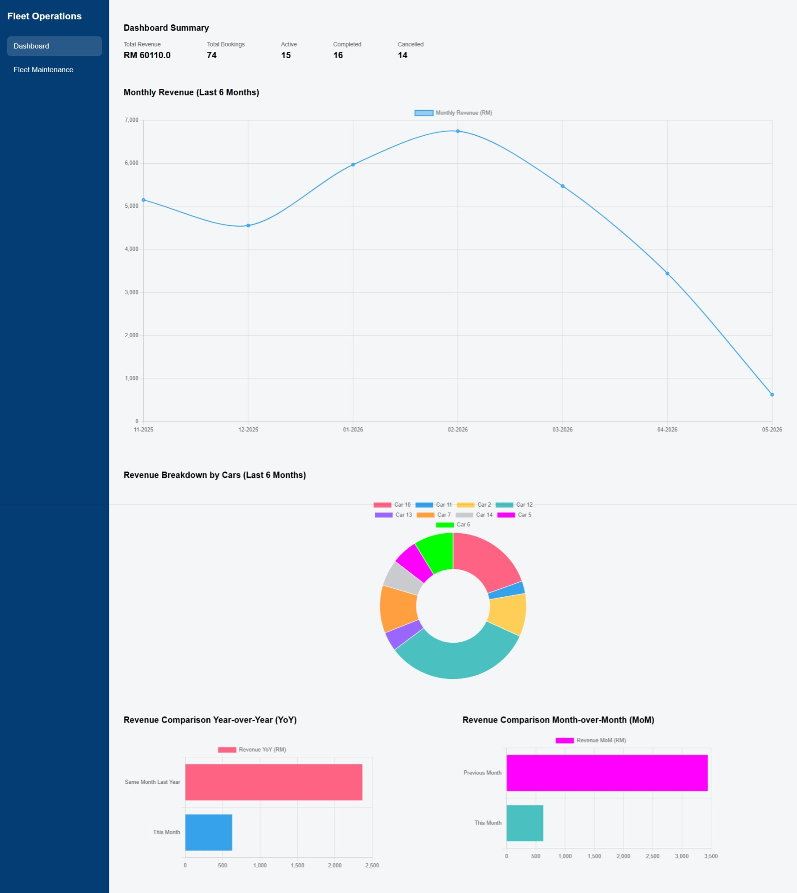
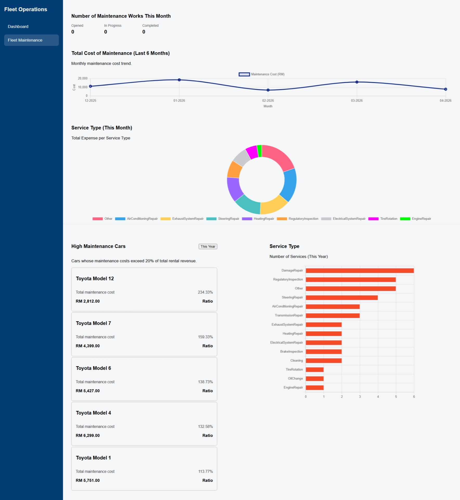

# Operations Reporting Dashboard
The system is built using ASP.NET Core MVC, Entity Framework Core, and Chart.js. It is designed to support the management of company assets and operations, specifically tailored for a car rental business. 

- Operational Performance
    - Monthly revenue
    - Revenue breakdown
    - Revenue comparison (YoY, MoM)
- Fleet Maintenance
    - Number of Maintenance Works
    - Total Cost of Maintenance 
    - Total Expense per Service Type
    - Number of Services per Service Type
    - High Maintenance Cars


## Setup Instructions
**Prerequisite**
- ASP.NET
- ChartJS

1. **Clone the repository**
```
git clone https://github.com/jackleZac/operations-reporting-dashboard.git
cd OperationsReportingDashboard
```
2. Install **dotnet EF** (CLI tool for managing database)
```
dotnet tool install --global dotnet-ef
```
3. Compile the project into executable files
```
dotnet build
```
4. Run the project
```
dotnet run
```

## User Interface



# Dotnet EF Commands
```
dotnet ef migrations add {{ describe the changes }}
dotnet ef database update
dotnet ef migrations remove
```